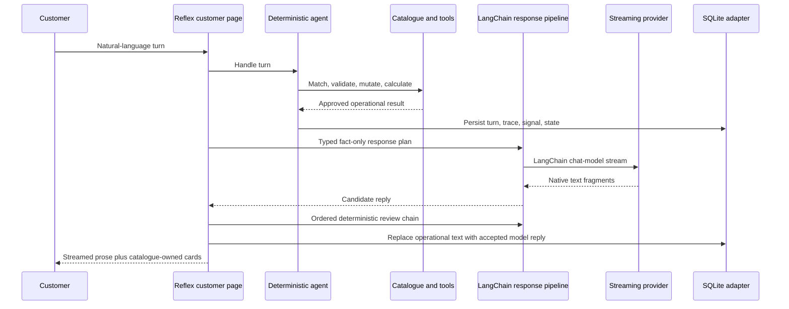

# Architecture

I keep generated language outside the transaction boundary. `ConversationalTaskAgent` classifies each turn and calls deterministic functions for extraction, catalogue matching, cart mutation, fulfilment capture, bill calculation, validation, confirmation, persistence, context signals, and handover decisions. The persisted session carries the last small set of matched menu variants so pronoun and typo-heavy follow-up questions resolve against the item already under discussion.

The Reflex customer route runs that operational turn first. `LangChainResponsePipeline` validates a typed response plan, builds the chat messages with `ChatPromptTemplate`, and streams the configured provider through a LangChain `BaseChatModel` adapter. Raw customer history and raw customer wording are withheld from this generation call; the model receives the tool-owned brief and a narrow response-writing task. `GroundedStreamingResponder` buffers the complete short turn and sends it through the pipeline's second runnable, where OrderFlow's deterministic reviewers reject invented items, ingredients, ingredient amounts, measurements, prices, currencies, confirmations, cart changes, prohibited commitments, internal fact labels, and unsupported customer-data requests. A rejected turn is retried out of view; an accepted turn is released through its original fragments.

I do not substitute the operational response when a provider fails. The public page shows a service notice, removes an empty assistant turn, and records the failure for staff inspection.

## Interface Boundaries

| Route | Audience | Content |
| --- | --- | --- |
| `/` | Customer | Live model conversation, actionable product media, current cart, fulfilment stage, support ticket status and staff replies |
| `/staff` | Restaurant employee or demo operator | Section-based orders, exports, ticket inbox, catalogue, menu intelligence, evaluation, knowledge, traces, provider settings |

The routes share domain and storage services, but diagnostic detail is never rendered on the customer page. The staff route is separated structurally; a shared deployment still needs authentication and role authorization.

## Main Modules

| Module | Responsibility |
| --- | --- |
| `orderflow_reflex/orderflow_reflex.py` | Customer and staff pages, per-browser state, stream updates, operations controls |
| `agent.py` | Session lifecycle, intent routing, fulfilment flow, confirmation gates, operational result |
| `runtime/streaming.py` | Provider stream orchestration, hidden retry, and complete-turn grounding before fragment release |
| `runtime/response_pipeline.py` | LangChain prompt chain, provider chat-model adapter, typed response plan, and ordered review chain |
| `runtime/customer_service.py` | Process-scoped provider configuration and shared model instance |
| `tools.py` | Catalogue extraction, matching, cart mutation, validation, and billing |
| `catalog.py` | Typed JSON catalogue, validation, and atomic administration writes |
| `storage.py` | SQLite sessions, turns, traces, signals, orders, handover tickets and messages, and knowledge |
| `context/` | Observable and explainable conversation signals |
| `handover/` | Escalation policy, preserved cases, and structured employee summary |
| `multimodal/` | Pluggable text/image representations, ranking, and synthetic demo scoring |
| `evaluation/` | Scenario replay, metrics, and reproducible JSON/CSV/Markdown artifacts |
| `runtime/providers.py` | Explicit hosted and local model adapters |
| `runtime/rag.py` | Ingestion, lexical/vector retrieval, rank fusion, and source traces |

## Transaction Invariants

- Only active catalogue items can enter the cart.
- Every price and total comes from the loaded catalogue.
- Quantities are validated before confirmation and again before persistence.
- Delivery requires a customer-supplied address; pickup stores no address.
- A confirmation request only opens a pending gate.
- A separate unambiguous yes is required to save an order.
- A mixed reply that also requests a change cannot confirm the order.
- Prompt-replacement and input-abuse checks run before intent extraction, cart mutation, address capture, or confirmation.
- A single item is limited to 20 units and a complete order to 50 units.
- A provider has no storage, catalogue, payment, or order-persistence tool.
- A provider cannot change the active menu topic, infer an unlisted ingredient amount, or answer outside the pizza-service domain.
- A pending handover locks automated transaction changes until an employee completes the case.
- Customer messages sent during a pending handover go to the ticket conversation, not the automated order workflow.
- Conversation frustration alone cannot trigger a high-impact handover.

## State Flow

Menu-card add actions enter the same agent and tool path as a typed order, using an exact catalogue SKU. When the agent creates a handover, SQLite orders pending cases by creation time. The customer and staff pages poll that shared adapter for queue movement, ticket messages, and resolution; no diagnostic state is exposed on the customer route.

## Extension Points

`CatalogStore` and `StorageAdapter` are protocols, so a shared deployment can replace JSON and SQLite. `MenuEmbeddingBackend` accepts another representation model without changing catalogue constraints. `ProviderRegistry` owns explicit adapter selection. `HandoverPolicy` carries configurable misunderstanding and validation thresholds.

The earlier `gradio_ui.py` and `ui.py` modules remain for compatibility, but `app.py` launches the Reflex application.
